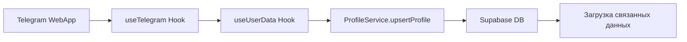
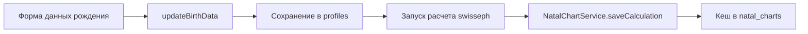
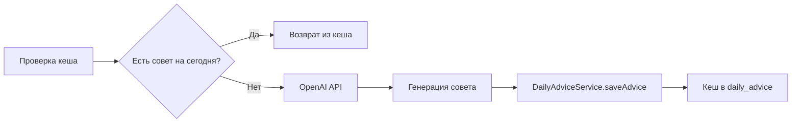

# 🚀 Supabase Integration Guide

## 📋 Обзор архитектуры

Интеграция с Supabase реализована для хранения данных пользователей, натальных карт, ежедневных советов и настроек. Архитектура построена на принципах модульности и кеширования для оптимальной производительности.

## 🗄️ Структура базы данных

### Основные таблицы:

1. **`profiles`** - Профили пользователей
   - Хранит базовую информацию из Telegram
   - Данные рождения для астрологических расчетов
   - Связан со всеми остальными таблицами

2. **`natal_charts`** - Кеш натальных карт
   - Результаты астрологических расчетов
   - JSONB поле для полных данных карты
   - Обновляется раз в 30 дней

3. **`daily_advice`** - Кеш ежедневных советов
   - Персонализированные советы на каждый день
   - Астрологический контекст
   - Уникальность по дате и пользователю

4. **`user_settings`** - Настройки пользователей
   - Уведомления, тема, язык
   - Тон советов (позитивный/сбалансированный/реалистичный)

## 🔧 Настройка Supabase

### 1. Создание проекта

1. Зайдите на [supabase.com](https://supabase.com)
2. Создайте новый проект
3. Скопируйте URL и Anon Key из настроек проекта

### 2. Применение миграций

Выполните SQL из файла `/supabase/migrations/001_create_tables.sql` в SQL Editor Supabase:

```sql
-- Скопируйте содержимое файла миграции
-- и выполните в Supabase SQL Editor
```

### 3. Настройка переменных окружения

Создайте файл `.env.local` на основе `.env.example`:

```bash
cp .env.example .env.local
```

Заполните переменные:

```env
NEXT_PUBLIC_SUPABASE_URL=https://your-project.supabase.co
NEXT_PUBLIC_SUPABASE_ANON_KEY=your-anon-key
```

## 📁 Структура файлов

```
src/
├── lib/
│   └── supabase.ts           # Инициализация клиента
├── types/
│   └── database.ts           # TypeScript типы
├── services/
│   ├── profile.service.ts    # Работа с профилями
│   ├── natal-chart.service.ts # Работа с натальными картами
│   ├── daily-advice.service.ts # Работа с советами
│   └── user-settings.service.ts # Работа с настройками
└── hooks/
    └── useUserData.ts        # Главный хук интеграции
```

## 🎯 Использование в компонентах

### Базовое использование хука `useUserData`:

```tsx
import { useUserData } from '@/hooks/useUserData'

export function MyComponent() {
  const {
    profile,
    natalChart,
    todayAdvice,
    settings,
    isLoading,
    error,
    updateBirthData,
    refreshDailyAdvice
  } = useUserData()

  if (isLoading) return <div>Загрузка...</div>
  if (error) return <div>Ошибка: {error}</div>

  return (
    <div>
      <h1>Привет, {profile?.first_name}!</h1>
      {todayAdvice && (
        <p>{todayAdvice.advice_text}</p>
      )}
    </div>
  )
}
```

### Обновление данных рождения:

```tsx
const { updateBirthData } = useUserData()

const handleSubmit = async (formData) => {
  const success = await updateBirthData({
    birth_date: formData.date,
    birth_time: formData.time,
    birth_place: formData.place
  })
  
  if (success) {
    // Данные успешно обновлены
    // Можно запросить расчет натальной карты
  }
}
```

## 🔄 Поток данных

### 1. Инициализация пользователя:



### 2. Расчет натальной карты:



### 3. Генерация совета:



## 🛠️ Сервисы

### ProfileService

```typescript
// Создание/обновление профиля
await ProfileService.upsertProfile(data)

// Получение профиля
await ProfileService.getProfileByTelegramId(telegramId)

// Обновление данных рождения
await ProfileService.updateBirthData(profileId, birthData)
```

### NatalChartService

```typescript
// Получение натальной карты
await NatalChartService.getByProfileId(profileId)

// Сохранение расчета
await NatalChartService.saveCalculation(profileId, chartData)

// Проверка необходимости пересчета
NatalChartService.needsRecalculation(chart)
```

### DailyAdviceService

```typescript
// Получение совета на сегодня
await DailyAdviceService.getTodayAdvice(profileId)

// Сохранение нового совета
await DailyAdviceService.saveAdvice(profileId, text, context)

// История советов
await DailyAdviceService.getAdviceHistory(profileId, limit)
```

### UserSettingsService

```typescript
// Получение или создание настроек
await UserSettingsService.getOrCreateSettings(profileId)

// Обновление настроек
await UserSettingsService.updateSettings(profileId, updates)

// Переключение уведомлений
await UserSettingsService.toggleNotifications(profileId)
```

## 🔐 Безопасность

### Row Level Security (RLS)

Все таблицы защищены политиками RLS. В текущей реализации политики настроены для открытого доступа, но должны быть обновлены для production:

```sql
-- Пример политики для production
CREATE POLICY "Users can view own profile" ON profiles
  FOR SELECT USING (telegram_id = current_user_telegram_id());
```

### Переменные окружения

- Используйте `NEXT_PUBLIC_` префикс только для публичных ключей
- Никогда не коммитьте `.env.local` в git
- Используйте разные ключи для dev/staging/production

## 🚀 Деплой

### Vercel

1. Добавьте переменные окружения в настройках проекта Vercel
2. Убедитесь, что URL приложения правильный в Supabase Auth settings

### Миграции в production

1. Используйте Supabase CLI для управления миграциями:

```bash
supabase db push
```

2. Или примените миграции через Dashboard

## 📊 Мониторинг

### Полезные запросы для анализа:

```sql
-- Количество пользователей
SELECT COUNT(*) FROM profiles;

-- Активные пользователи за последние 7 дней
SELECT COUNT(DISTINCT profile_id) 
FROM daily_advice 
WHERE created_at > NOW() - INTERVAL '7 days';

-- Статистика по настройкам
SELECT 
  advice_tone, 
  COUNT(*) as count 
FROM user_settings 
GROUP BY advice_tone;
```

## 🐛 Отладка

### Проверка подключения:

```typescript
import { supabase } from '@/lib/supabase'

// Тест подключения
const { data, error } = await supabase
  .from('profiles')
  .select('count')
  
console.log('Connection test:', { data, error })
```

### Логирование ошибок:

Все сервисы логируют ошибки в консоль. Для production рекомендуется использовать Sentry или аналогичный сервис.

## 📝 Чеклист интеграции

- [ ] Создан проект Supabase
- [ ] Применены SQL миграции
- [ ] Настроены переменные окружения
- [ ] Установлен пакет `@supabase/supabase-js`
- [ ] Проверено подключение к базе
- [ ] Настроены политики RLS для production
- [ ] Протестирован основной флоу пользователя
- [ ] Настроен мониторинг ошибок

## 🤝 Поддержка

При возникновении проблем:

1. Проверьте логи в Supabase Dashboard
2. Убедитесь, что переменные окружения корректны
3. Проверьте сетевые запросы в DevTools
4. Обратитесь к документации Supabase: https://supabase.com/docs